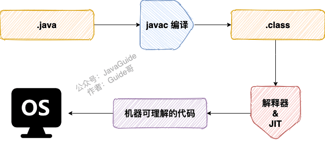
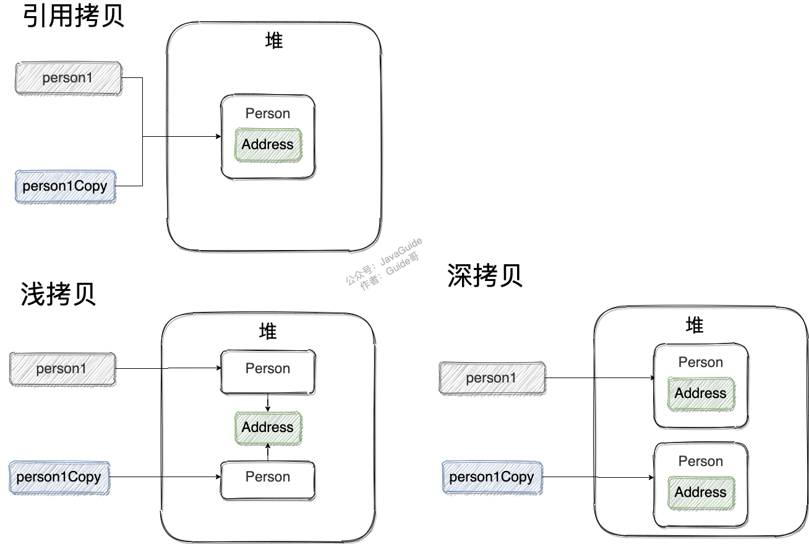

> ## Java基础知识 & 面试题总结
>
> [Java基础知识&面试题总结 | JavaGuide](https://javaguide.cn/java/basis/java基础知识总结/)
>
> 希望通过这个，能够~~比看视频~~更快速地做一次简单整理，也许也能方便以后的复习。


# 1 基础概念与常识


## 1.1 Java语言的特点

1. 简单易学
2. 面向对象（封装，继承，多态）
3. 平台无关性（Java虚拟机实现平台无关性）
4. 支持多线程
5. 可靠性
6. 安全性
7. 支持网络编程
8. 编译与解释并存


## 1.2 JVM & JDK & JRE

1. Java 虚拟机（JVM）是运行 Java 字节码的虚拟机。JVM 有针对不同系统的特定实现（Windows，Linux，macOS），目的是使用相同的字节码，它们都会给出相同的结果。
2. Java 虚拟机（JVM）是运行 Java 字节码的虚拟机。JVM 有针对不同系统的特定实现（Windows，Linux，macOS），目的是使用相同的字节码，它们都会给出相同的结果。
3. JDK 是 Java Development Kit 缩写，它是功能齐全的 Java SDK。它拥有 JRE 所拥有的一切，还有编译器（javac）和工具（如 javadoc 和 jdb）。

> JDK > JRE > JVM


## 1.3 字节码及优点

JVM 可以理解的代码就叫做字节码（即扩展名为 `.class` 的文件），它不面向任何特定的处理器，只面向虚拟机。

- Java 语言通过字节码的方式，在一定程度上解决了传统解释型语言执行效率低的问题，同时又保留了解释型语言可移植的特点。
- 由于字节码并不针对一种特定的机器，因此，Java 程序无须重新编译便可在多种不同操作系统的计算机上运行。




## 1.4 编译与解释并存

由 Java 编写的程序需要先经过编译步骤，生成字节码（`.class` 文件），这种字节码必须由 Java 解释器来解释执行。

> 为什么要这么做？
>
> 编译型语言执行速度快、开发效率低，解释型语言开发效率快、执行速度慢。
>
> 编译与解释并存，（猜测应该）能融合两者的优点，提升开发效率的同时、保证执行速度。


## 1.5 Oracle JDK & OpenJDK

不懂，先不管

[Java基础知识&面试题总结 | JavaGuide](https://javaguide.cn/java/basis/java基础知识总结/#oracle-jdk-vs-openjdk)


## 1.6 Java 和 C++ 的区别

- 都是面向对象的语言，都支持封装、继承、多态
- Java不提供指针来直接访问内存，程序内存更加安全
- Java的类是单继承的，但是接口可以多继承；C++支持类多重继承
- Java有自动内存管理垃圾回收机制 （GC），不需要程序员手动释放无用内存
- C++同时支持方法重载和操作符重载，但是Java只支持方法重载（重载操作符增加了复杂性）
- 。。。


# 2 基本语法


## 2.0 详见[JavaGuide #基本语法](https://javaguide.cn/java/basis/java基础知识总结/#基本语法)


## 2.1 静态方法为什么不能调用非静态方法？

1. 静态方法是属于类的，在类加载的时候就会分配内存，可以通过类名直接访问。而非静态成员属于实例对象，只有在对象实例化之后才存在，需要通过类的实例对象去访问。
2. 在类的非静态成员不存在的时候静态成员就已经存在了，此时调用在内存中还不存在的非静态成员，属于非法操作。


## 2.2 重载和重写的区别

> 重载就是同样的一个方法能够根据输入数据的不同，做出不同的处理
>
> 重写就是当子类继承自父类的相同方法，输入数据一样，但要做出有别于父类的响应时，你就要覆盖父类方法


**重载：**发生在同一个类中（或者父类和子类之间），方法名必须相同，参数类型不同、个数不同、顺序不同，方法返回值和访问修饰符可以不同。

**重写**

重写发生在运行期，是子类对父类的允许访问的方法的实现过程进行重新编写。

1. 返回值类型、方法名、参数列表必须相同，抛出的异常范围小于等于父类，访问修饰符范围大于等于父类。
2. 如果父类方法访问修饰符为 `private/final/static` 则子类就不能重写该方法，但是被 static 修饰的方法能够被再次声明。
3. 构造方法无法被重写

综上：**重写就是子类对父类方法的重新改造，外部样子不能改变，内部逻辑可以改变。**

| 区别点     | 重载方法 | 重写方法                                                     |
| :--------- | :------- | :----------------------------------------------------------- |
| 发生范围   | 同一个类 | 子类                                                         |
| 参数列表   | 必须修改 | 一定不能修改                                                 |
| 返回类型   | 可修改   | 子类方法返回值类型应比父类方法返回值类型更小或相等           |
| 异常       | 可修改   | 子类方法声明抛出的异常类应比父类方法声明抛出的异常类更小或相等； |
| 访问修饰符 | 可修改   | 一定不能做更严格的限制（可以降低限制）                       |
| 发生阶段   | 编译期   | 运行期                                                       |


## 2.3 泛型

> **Java 泛型（generics）** 是 JDK 5 中引入的一个新特性, 泛型提供了编译时类型安全检测机制，该机制允许程序员在编译时检测到非法的类型。泛型的本质是参数化类型，也就是说所操作的数据类型被指定为一个参数。

Java 的泛型是伪泛型，这是因为 Java 在运行期间，所有的泛型信息都会被擦掉，这也就是通常所说类型擦除 。

详见[JavaGuide #泛型](https://javaguide.cn/java/basis/java基础知识总结/#泛型)


## 2.4 == 和 equals() 的区别

**`==`** 对于基本类型和引用类型的作用效果是不同的：

- 对于基本数据类型来说，`==` 比较的是值。
- 对于引用数据类型来说，`==` 比较的是对象的内存地址。

> 因为 Java 只有值传递，所以，对于 == 来说，不管是比较基本数据类型，还是引用数据类型的变量，其本质比较的都是值，只是引用类型变量存的值是对象的地址。

**`equals()`** 作用不能用于判断基本数据类型的变量，只能用来判断两个对象是否相等。`equals()`方法存在于`Object`类中，而`Object`类是所有类的直接或间接父类。


## 2.5 hashCode() 与 equals()

因为两个相等的对象的 `hashCode` 值必须是相等。也就是说如果 `equals` 方法判断两个对象是相等的，那这两个对象的 `hashCode` 值也要相等。

如果重写 `equals()` 时没有重写 `hashCode()` 方法的话就可能会导致 `equals` 方法判断是相等的两个对象，`hashCode` 值却不相等。


更多解释见[JavaGuide #hashcode-与-equals](https://javaguide.cn/java/basis/java基础知识总结/#hashcode-与-equals)


# 3 基本数据类型

> 基本数据类型直接存放在 Java 虚拟机栈中的局部变量表中，而包装类型属于对象类型，我们知道对象实例都存在于堆中。


## 3.1 包装类型的常量池

`Byte`,`Short`,`Integer`,`Long` 这 4 种包装类默认创建了数值 **[-128，127]** 的相应类型的缓存数据，`Character` 创建了数值在 **[0,127]** 范围的缓存数据，`Boolean` 直接返回 `True` or `False`。 


解释来说呢，大概就是以上几种类型中，创建的对象大小在约定的范围之内，该对象会在cache中长生（如果已存在将会复用）。

- 节省内存空间：常量池中所有相同的对象常量被合并，只占用一个空间。
- 节省运行时间：比较字符串时，==比equals()快。对于两个引用变量，只用==判断引用是否相等，也就可以判断实际值是否相等。


# 4 Java面向对象


## 4.1 面向对象和面向过程的区别

-  因为类调用时需要实例化，开销比较大，比较消耗资源，所以当性能是最重要的考量因素的时候，比如单片机、嵌入式开发、Linux/Unix 等一般采用面向过程开发。

- 因为面向对象有封装、继承、多态性的特性，所以可以设计出低耦合的系统，使系统更加灵活、更加易于维护。

> **面向对象易维护、易复用、易扩展。面向过程性能相对较高。**


## 4.2 成员变量和局部变量的区别


## 4.3 对象实体和对象引用

一个对象引用可以指向 0 个或 1 个对象（一根绳子可以不系气球，也可以系一个气球）;一个对象可以有 n 个引用指向它（可以用 n 条绳子系住一个气球）。


## 4.4 对象相等和引用相等

对象的相等，比的是内存中存放的内容是否相等。而引用相等，比较的是他们指向的内存地址是否相等。


## 4.5 构造方法的特点

1. 名字与类名相同。
2. 没有返回值，但不能用 void 声明构造函数。
3. 生成类的对象时自动执行，无需调用。

> 构造方法不能被 override（重写）,但是可以 overload（重载）,所以你可以看到一个类中有多个构造函数的情况。


## 4.6 面向对象三大特征


### 4.6.1 封装

封装是指把一个对象的状态信息（也就是属性）隐藏在对象内部，不允许外部对象直接访问对象的内部信息。但是可以提供一些可以被外界访问的方法来操作属性。

```java
public class Student {
    private int id;//id属性私有化
    private String name;//name属性私有化

    //获取id的方法
    public int getId() { return id; }

    //设置id的方法
    public void setId(int id) { this.id = id; }

    //获取name的方法
    public String getName() { return name; }

    //设置name的方法
    public void setName(String name) { this.name = name; }
}
```


### 4.6.2 继承

继承是使用已存在的类的定义作为基础建立新类的技术，新类的定义可以增加新的数据或新的功能，也可以用父类的功能，但不能选择性地继承父类。通过使用继承，可以快速地创建新的类，可以提高代码的重用，程序的可维护性，节省大量创建新类的时间 ，提高我们的开发效率。

1. 子类拥有父类对象所有的属性和方法（包括私有属性和私有方法），但是父类中的私有属性和方法子类是无法访问，**只是拥有**。
2. 子类可以拥有自己属性和方法，即子类可以对父类进行扩展。
3. 子类可以用自己的方式实现父类的方法。


### 4.6.3 多态

表示一个对象具有多种的状态，具体表现为父类的引用指向子类的实例。

- 对象类型和引用类型之间具有继承（类）/实现（接口）的关系；
- 引用类型变量发出的方法调用的到底是哪个类中的方法，必须在程序**运行期间**才能确定；
- 多态不能调用“**只在子类存在但在父类不存在**”的方法；
- 如果子类重写了父类的方法，真正执行的是**子类覆盖**的方法，如果子类没有覆盖父类的方法，执行的是父类的方法。


## 4.7 `String`、`StringBuffer`、`StringBuilder`


### 4.7.1 `String` 为什么是不可变的

[String为什么不可变 - 梦醒点灯](https://www.cnblogs.com/leskang/p/6110631.html)

```java
public final class String implements java.io.Serializable, Comparable<String>, CharSequence {
    private final char value[];
	//...
}
```

1. 保存字符串的数组被 `final` 修饰且为私有的，并且`String` 类没有提供/暴露修改这个字符串的方法。
2. `String` 类被 `final` 修饰导致其不能被继承，进而避免了子类破坏 `String` 不可变。


### 4.7.2 `StringBuffer`、`StringBuilder`

`StringBuilder` 与 `StringBuffer` 都继承自 `AbstractStringBuilder` 类，在 `AbstractStringBuilder` 中也是使用字符数组保存字符串，不过没有使用 `final` 和 `private` 关键字修饰，最关键的是这个 `AbstractStringBuilder` 类还提供了很多修改字符串的方法比如 `append` 方法。

```java
abstract class AbstractStringBuilder implements Appendable, CharSequence {
    char[] value;
    public AbstractStringBuilder append(String str) {
        if (str == null)
            return appendNull();
        int len = str.length();
        ensureCapacityInternal(count + len);
        str.getChars(0, len, value, count);
        count += len;
        return this;
    }
  	//...
}
```


### 4.7.3 线程安全性

> `String`、`StringBuffer` 是线程安全的，`StringBuilder` 非线程安全。

- `String` 中的对象是不可变的，也就可以理解为常量，线程安全。
- `AbstractStringBuilder` 是 `StringBuilder` 与 `StringBuffer` 的公共父类，定义了一些字符串的基本操作，如 `expandCapacity`、`append`、`insert`、`indexOf` 等公共方法。
  - `StringBuffer` 对方法加了同步锁或者对调用的方法加了同步锁，所以是线程安全的。
  - `StringBuilder` 并没有对方法进行加同步锁，所以是非线程安全的。


### 4.7.4 性能

`StringBuilder` > `StringBuffer` > `String`

每次对 `String` 类型进行改变的时候，都会生成一个新的 `String` 对象，然后将指针指向新的 `String` 对象。`StringBuffer` 每次都会对 `StringBuffer` 对象本身进行操作，而不是生成新的对象并改变对象引用。相同情况下使用 `StringBuilder` 相比使用 `StringBuffer` 仅能获得 10%~15% 左右的性能提升，但却要冒多线程不安全的风险。 

1. 操作少量的数据: 适用 `String`
2. 单线程操作字符串缓冲区下操作大量数据: 适用 `StringBuilder`
3. 多线程操作字符串缓冲区下操作大量数据: 适用 `StringBuffer`


## 4.8 `Object` 类的常见方法

```java
//native方法，用于返回当前运行时对象的Class对象，使用了final关键字修饰，故不允许子类重写。
public final native Class<?> getClass()
    
//native方法，用于返回对象的哈希码，主要使用在哈希表中，比如JDK中的HashMap。
public native int hashCode() 
    
//用于比较2个对象的内存地址是否相等，String类对该方法进行了重写用户比较字符串的值是否相等。
public boolean equals(Object obj)
    
//naitive方法，用于创建并返回当前对象的一份拷贝。一般情况下，对于任何对象 x，表达式 x.clone() != x 为true，x.clone().getClass() == x.getClass() 为true。Object本身没有实现Cloneable接口，所以不重写clone方法并且进行调用的话会发生CloneNotSupportedException异常。
protected native Object clone() throws CloneNotSupportedException
    
//返回类的名字@实例的哈希码的16进制的字符串。建议Object所有的子类都重写这个方法。
public String toString()
    
//native方法，并且不能重写。唤醒一个在此对象监视器上等待的线程(监视器相当于就是锁的概念)。如果有多个线程在等待只会任意唤醒一个。
public final native void notify()

//native方法，并且不能重写。跟notify一样，唯一的区别就是会唤醒在此对象监视器上等待的所有线程，而不是一个线程。
public final native void notifyAll()
    
//native方法，并且不能重写。暂停线程的执行。注意：sleep方法没有释放锁，而wait方法释放了锁 。timeout是等待时间。
public final native void wait(long timeout) throws InterruptedException
    
//多了nanos参数，这个参数表示额外时间（以毫微秒为单位，范围是 0-999999）。 所以超时的时间还需要加上nanos毫秒。
public final void wait(long timeout, int nanos) throws InterruptedException
    
//跟之前的2个wait方法一样，只不过该方法一直等待，没有超时时间这个概念
public final void wait() throws InterruptedException
    
//实例被垃圾回收器回收的时候触发的操作
protected void finalize() throws Throwable { }
```


## 4.9 深拷贝和浅拷贝、引用拷贝

> **浅拷贝**：浅拷贝会在堆上创建一个新的对象（区别于引用拷贝的一点），不过，如果原对象内部的属性是引用类型的话，浅拷贝会直接复制内部对象的引用地址，也就是说拷贝对象和原对象共用同一个内部对象。
>
> **深拷贝** ：深拷贝会完全复制整个对象，包括这个对象所包含的内部对象。


引用拷贝就是两个不同的引用指向同一个对象。


