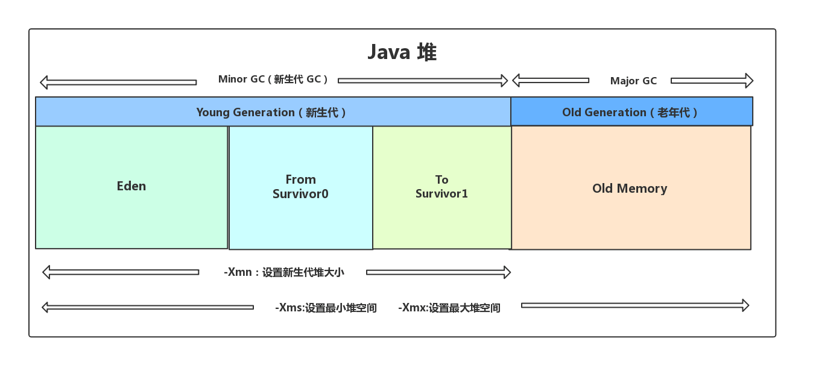

> [JVM 垃圾回收详解 | JavaGuide](https://javaguide.cn/java/jvm/jvm-garbage-collection/)

# 写在前面

## 常见面试题

- 如何判断对象是否死亡（两种方法）。
- 简单的介绍一下强引用、软引用、弱引用、虚引用（虚引用与软引用和弱引用的区别、使用软引用能带来的好处）。
- 如何判断一个常量是废弃常量
- 如何判断一个类是无用的类
- 垃圾收集有哪些算法，各自的特点？
- HotSpot 为什么要分为新生代和老年代？
- 常见的垃圾回收器有哪些？
- 介绍一下 CMS,G1 收集器。
- Minor Gc 和 Full GC 有什么不同呢？

## 核心问题

1. 内存如何分配和回收
2. 哪些垃圾需要回收
3. 什么时候回收
4. 如何回收

# 一、JVM内存分配与回收

Java 的自动内存管理主要是针对**对象内存**的回收和对象内存的分配。同时，Java 自动内存管理最核心的功能是 **堆** 内存中对象的分配与回收。

Java 堆是垃圾收集器管理的主要区域，因此也被称作**GC 堆（Garbage Collected Heap）**.从垃圾回收的角度，由于现在收集器基本都采用分代垃圾收集算法，所以 Java 堆还可以细分为：新生代和老年代：再细致一点有：Eden 空间、From Survivor、To Survivor 空间等。**进一步划分的目的是更好地回收内存，或者更快地分配内存。**

> ## 第一次理解
>
> 如图所示，一般对象的创建，会先分配到图左1的 `Eden` 区域，随着垃圾回收的进行，仍然存活的对象会根据存活时间向老年代转移。
>
> ## 常见分配策略
>
> 1. 对象优先在 `Eden` 区域分配
> 2. 大对象直接进入老年代
> 3. 长期存活的对象将进入老年代

## 1.1 对象优先在 `Eden` 区域分配

目前主流的垃圾收集器都会采用**分代回收算法**，因此需要将堆内存分为新生代和老年代，这样我们就可以根据各个年代的特点选择合适的垃圾收集算法。

大多数情况下，对象在新生代中 eden 区分配。当 eden 区没有足够空间进行分配时，虚拟机将发起一次 Minor GC.

具体测试见 [JVM 垃圾回收详解 | JavaGuide | 1.1 对象优先在 `Eden` 区域分配](https://javaguide.cn/java/jvm/jvm-garbage-collection/#_1-1-对象优先在-eden-区分配)

## 1.2 大对象直接进入老年代

**为什么要这样呢？**

为了避免为大对象分配内存时由于分配担保机制带来的复制而降低效率。（我的理解是：eden中内存分配不足时，总有对象要被转移到老年代的，不如一开始就将比较大的对象直接分配在老年代）

## 1.3 长期存活的对象将进入老年代

如果对象在 Eden 出生并经过第一次 Minor GC 后仍然能够存活，并且能被 Survivor 容纳的话，将被移动到 Survivor 空间中，并将对象年龄设为 1.对象在 Survivor 中每熬过一次 MinorGC,年龄就增加 1 岁，当它的年龄增加到一定程度（默认为 15 岁），就会被晋升到老年代中。对象晋升到老年代的年龄阈值，可以通过参数 `-XX:MaxTenuringThreshold` 来设置。

