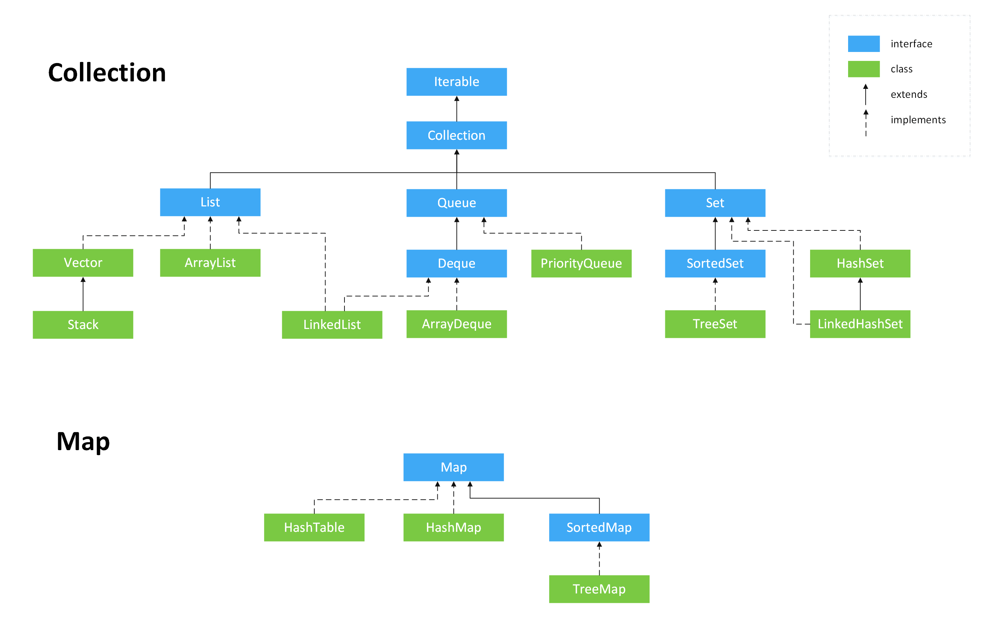
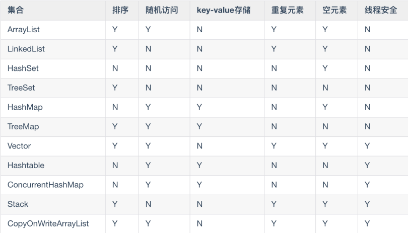

# 一、集合概述

## 1.0 Java集合概览

## 1.1 集合框架底层数据结构

- `Collection`
  - `List`
    - `ArrayList`: Object[] 数组
    - `Vector`: Object[] 数组
    - `LinkedList`: 双向链表
  - `Set`
    - `HashSet`（无序）: 基于 `HashMap` 实现
    - `LinkedHashSet`: `HashSet` 的子类，基于 `LinkedHashMap` 实现
    - `TreeSet`（有序）: 红黑树（自平衡的排序二叉树）
  - `Queue`
    - `PriorityQueue` : Object[] 数组实现二叉堆
    - `ArrayQueue` : Object[] 数组 + 双指针
- `Map`
  - `HashMap` : 数组 + 链表 + 红黑树（链表根据大小和阈值进行扩容，扩容到一定大小转换为红黑树）
  - `LinkedMap` : 继承自 `HashMap`，增加一条双向链表以保持插入顺序
  - `Hashtable` : 数组 + 链表
  - `TreeMap` : 红黑树

## 1.2 集合的选择

