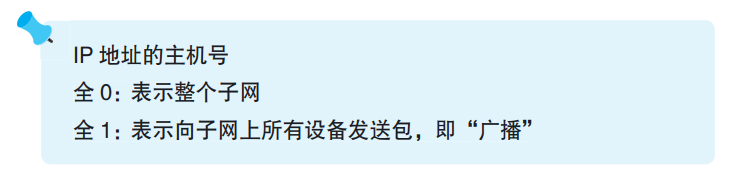
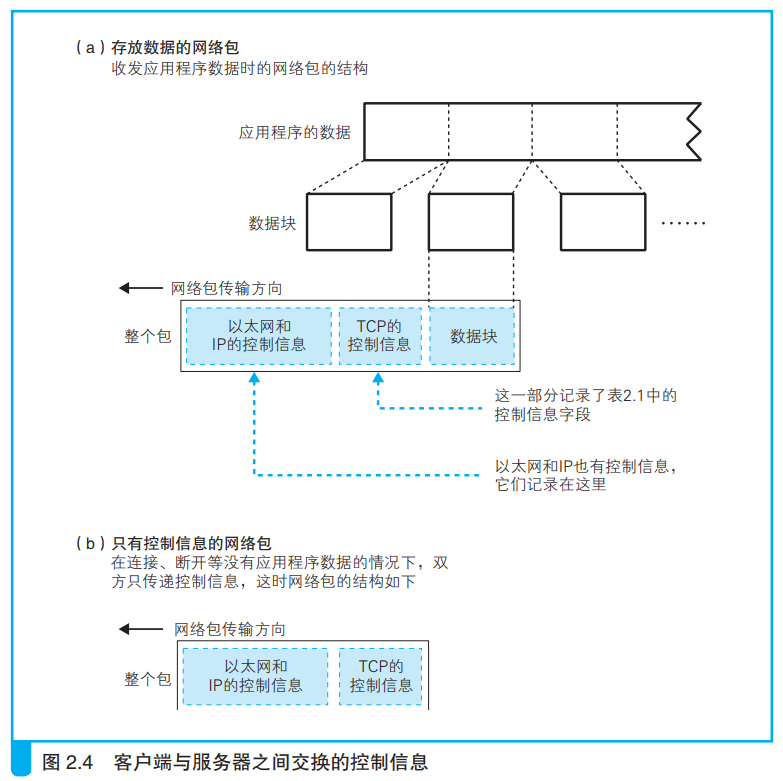
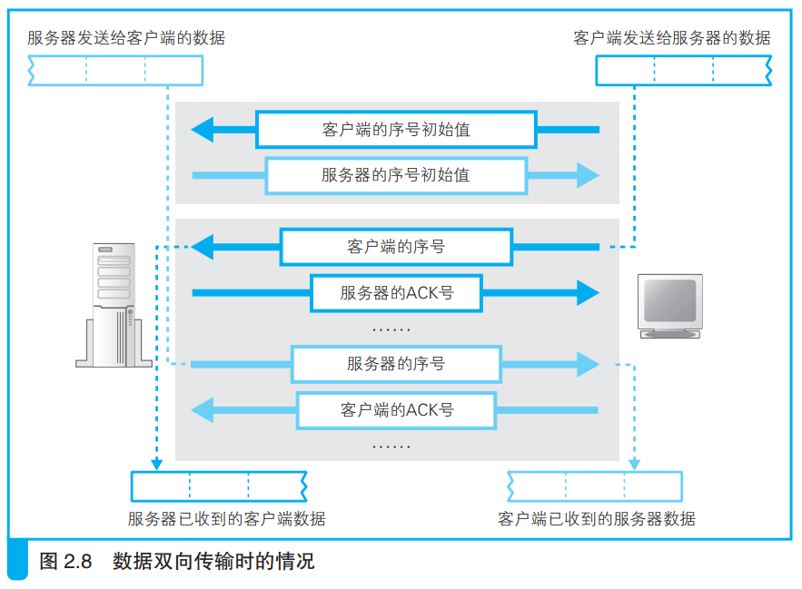
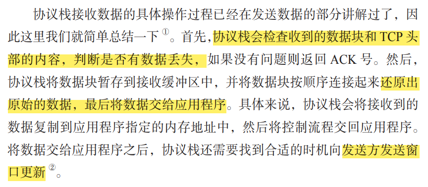
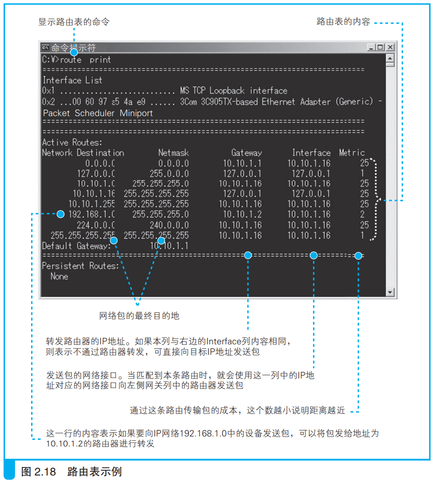
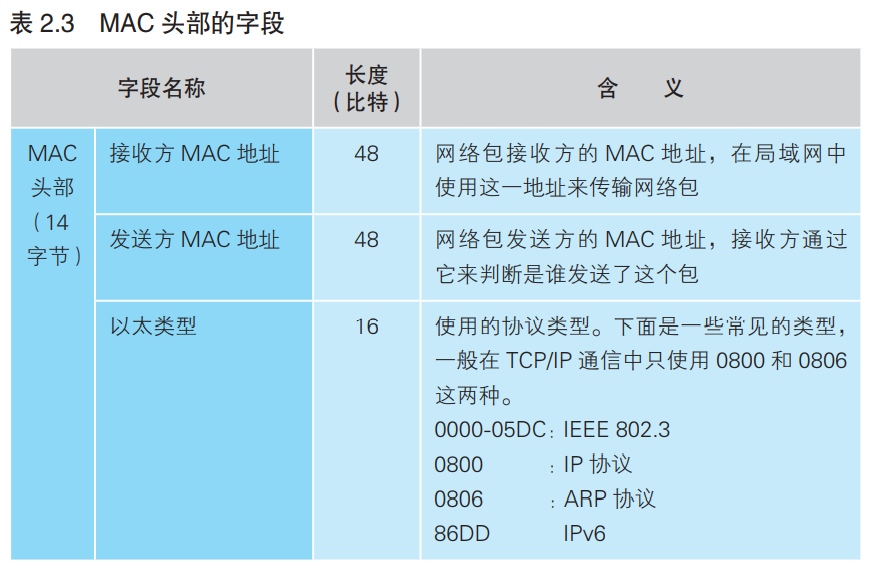
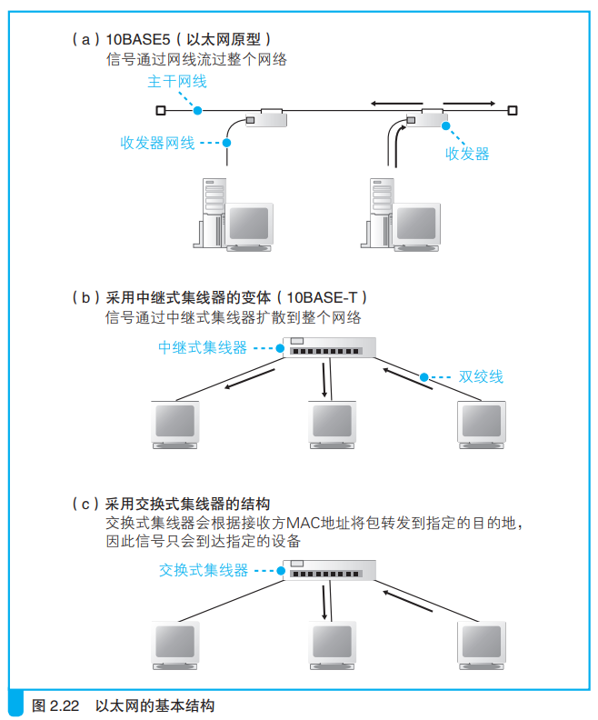
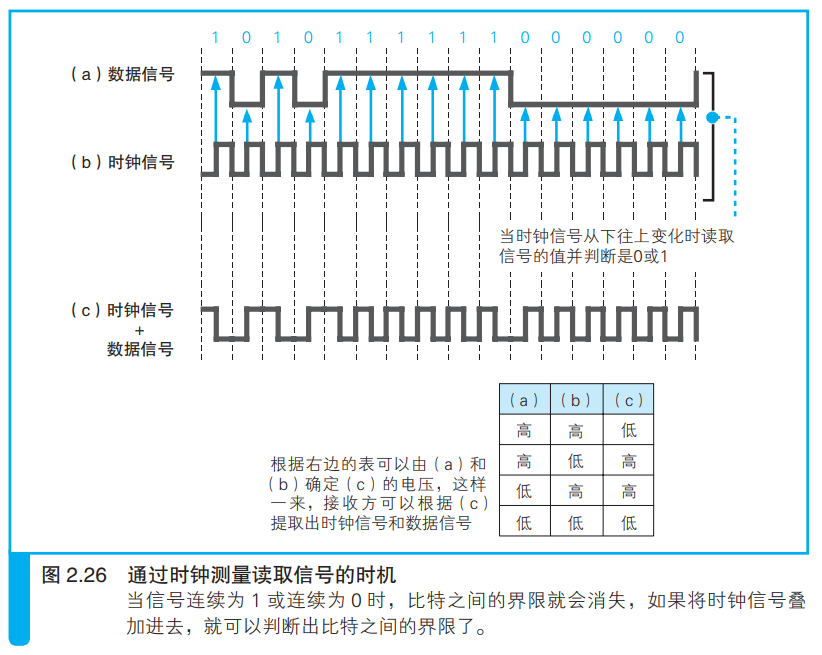

# 第一章 浏览器生成消息

## 1.1 生成 HTTP 请求消息

### 1.1.1 网址（URL, Uniform Resource Locator）

### 1.1.2 解析 URL

### 1.1.3 文件名省略

- 当 URL 以 `/` 结尾时，服务器会默认访问该路径下的 `index.html` 或 `default.html` 文件
- 当 URL 连 `/` 和文件类型都省略的时候：

（实测：当一个文件没有文件类型的时候，不允许和一个同名文件夹同时存在。而当这个文件有后缀时，应该会访问同名文件夹）

### 1.1.4 HTTP 基本思路

- 对什么 + 进行怎样的操作

### 1.1.5 生成 HTTP 请求信息

> 一条请求消息中只能写一个URI。如果需要获取多个文件，必须对每个文件单独发送一条请求

更多字段信息见文档 44 页。

### 1.1.6 服务器响应

> 状态码时一个数字，主要用来向程序告知执行的结果
>
> 响应短语是一段文字，用来向人们告知执行的结果

## 1.2 向 DNS 服务器查询 Web 服务器的 IP 地址

### 1.2.1 IP 地址的基本知识

- IP 地址是 32 比特的数字，被分成了4组
- 子网掩码也是 32 比特的数字
    - 左边全1的部分表示网络号
    - 右边全0的部分表示主机号

### 1.2.2 域名和IP地址并用的理由

- 域名比IP地址更容易记忆
- IP地址的传输比域名更高效（IP地址只是4字节的数字，域名最长可以是255字节的字符）

于是让人来使用域名，让路由器来使用IP地址，这个机制就是**DNS**。

### 1.2.3 Socket 库提供查询 IP 地址的功能

> **域名解析**：通过DNS查询IP地址的操作。

> **解析器**：负责执行域名解析的DNS客户端。（解析器实际上是一段程序。）

​	库是一堆通用程序组件的集合，他们具有诸多好处：

- 节省编程工作量
- 实现程序的标准化
- 等等

​	Socket库也是一种库，其中包含的程序组件可以让其他的应用程序调用操作系统的网络功能，而解析器就是这个库中的其中一种程序组件。

### 1.2.4 通过解析器向DNS服务器发出查询

- 调用解析器
- 解析器向DNS服务器发送查询消息
- DNS服务器返回响应消息
- 解析器从响应消息中取出IP地址并写入内存

根据域名查询IP地址时，浏览器会使用Socket库中的解析器。

### 1.2.5 解析器的内部原理

>  **控制流程转移**：由于调用了其他程序，原本运行的程序进入暂停状态，而被调用的程序开始运行。

- 从上往下顺序执行应用程序编写的操作内容，当到达需要调用解析器的部分时
- 控制流程转移到解析器，解析器会生成要发送给DNS服务器的查询消息
- 委托操作系统内部的协议栈来发送这个消息（因为解析器本身并不具备使用网络收发数据的功能

向DNS服务器发送消息时，也需要知道DNS服务器的IP地址。这是这个地址实现设置好了，不需要再查询。

## 1.3 DNS 服务器

### 1.3.1 DNS 服务器的基本工作

DNS 服务器的基本工作就是根据需要查询的域名和记录类型查找相关的记录，并向客户端返回响应消息。

- 域名：服务器、邮件服务器（邮件地址@后面的部分）的名称
- Class：代表互联网的IN
- 记录类型：表示域名对应何种类型的记录。

### 1.3.2 域名的层次结构

由于存在着不计其数的服务器，不可能将所有服务器的信息保存在一台DNS服务器中，只能是将这些信息分布保存在多态DNS服务器中。

- 按域名以分层次的结构来保存
- 域名中越靠右的位置表示气层级越高
- 每个域都是作为一个整体存放在DNS服务器中的

### 1.3.3 寻找相应的 DNS 服务器并获取 IP 地址

- 负责管理下级域的 DNS 服务器的 IP 地址注册到他们的上级 DNS 服务器中
- com和jp 的上面存在一个 根域
- 所有 DNS 服务器中都保存有根域的 DNS 服务器信息

### 1.3.4 通过缓存加快 DNS 服务器的响应

DNS 服务器有一个缓存功能，可以记住之前查询过的域名

- 如果要查询的域名和相关信息已经在缓存中，那么就可以直接返回响应。
- 当查询的域名不存在时，“不存在”这一响应结果也会被缓存
- 缓存信息设置有一个有效期，当信息超过有效期后，数据会从缓存中删除
- DNS服务器返回响应时，会告知这一响应结果是来自缓存还是来自负责管理该域名的DNS服务器

## 1.4 委托协议栈发送消息

### 1.4.1 数据收发操作概览

> 委托操作系统内部的协议栈发送HTTP消息，适用于**任何**网络应用程序。

- 创建套接字（出入口） —— 创建套接字阶段
- 【客户端】向【服务器端】套接字连接管道 —— 连接阶段
- 收发数据 —— 通信阶段
- 断开管道并删除套接字 —— 断开阶段

> 这个管道中，数据流动是**双向**的

### 1.4.2 创建套接字阶段

> 创建套接字需要调用 Socket 库中的 **socket 程序组件**

客户端创建套接字：

- 调用 Socket 库中的 socket 程序组件
- 控制流程转移到 socket 内部并执行创建套接字操作
- 控制流程交回应用程序

> 套接字创建完成以后，协议栈返回一个**描述符**，用来标识该套接字

### 1.4.3 连接阶段

> 连接阶段需要调用 Socket 库中的 **connect 程序组件**

调用 connect 时需要指定三个参数：描述符、服务器IP地址、端口号

### 1.4.4 通信阶段

> 通信阶段需要调用 Socket 库中的 **write 程序组件**、**read 程序组件**

发送数据：

- 生成 HTTP 请求消息
- 指定描述符和要发送的数据，由协议栈将数据发送到服务器

接收数据：

- 指定存放响应消息的内存地址（称为接收缓冲区）
- read 将接收到的响应消息存放到接收缓冲区中

### 1.4.5 断开阶段

> 断开阶段需要调用 Socket 库中的 **close 程序组件**

- Web服务器在发送完响应消息之后，会首先调用 close 来断开连接
- 客户端中 read 执行接收数据时，会告知浏览器通信阶段已结束
- 浏览器调用 close 进入断开阶段

### 1.4.6 各阶段功能和调用组件

|    阶段    |           组件            |
| :--------: | :-----------------------: |
| 创建套接字 |          socket           |
|    连接    |          connect          |
|    通信    | 发送：write 接收：read |
|    断开    |           close           |

## 1.5 本章回顾

- 网址前的 `http` 代表什么意思

> HTTP，即超文本传输协议，是 HyperText Transfer Protocol的缩写。

- 用来识别连接在互联网上的计算机和服务器的地址叫什么

> IP 地址

- 根据Web服务器的域名来查询IP地址时所用的服务器叫什么

> DNS 服务器

- 向DNS服务器发送请求消息的程序叫什么

> 协议栈

# 第二章 用电信号传输TCP/IP数据

## 2.0 前情提要

1. 创建套接字。
2. 连接服务器。
3. 收发数据。
4. 断开连接并删除套接字。
5. IP与以太网的包收发操作。
6. 用UDP协议收发数据的操作。

## 2.1 创建套接字

### 2.1.1 协议栈的内部结构

> 浏览器、邮件等一般应用程序收发数据时用TCP；
>
> DNS查询等收发较短的控制数据时用UDP。

> ICMP用于告知网络包传送过程中产生的错误以及各种控制消息；
>
> ARP用于根据IP地址查询相应的以太网MAC地址。

### 2.1.2 套接字的实体就是通信控制信息

> 协议栈是根据套接字中记录的控制信息来工作的。

### 2.1.3 调用 socket 时的操作

> 创建套接字时，首先分配一个套接字所需的内存空间，让后向其中写入初始状态。

## 2.2 连接服务器

### 2.2.1 连接

> 连接实际上是通信双方交换控制信息，在套接字中记录一些必要信息并准备数据收发的一连串操作。

- 把服务器的IP地址和端口号等信息告知协议栈
- 客户端向服务器传达开始通信的请求
- 开辟一个空间作为缓冲区

### 2.2.2 负责保存控制信息的头部

通信操作中使用的控制信息分为两类：

- 头部中记录的信息
- 套接字中记录的信息

### 2.2.3 连接操作的实际过程

- 在TCP模块处创建表示连接控制信息的头部
- 通过TCP头部中的发送方和接收方端口号可以找到要连接的套接字
    - TCP模块将信息发送给IP模块并委托它进行发送
    - IP模块执行网络包发送到达服务器
    - 服务器上的IP模块将接收的信息传递给TCP模块
    - 服务器上的TCP模块根据TCP头部中的信息找到端口号对应的套接字
    - 在套接字中写入相应信息，修改状态为正在连接，并向客户端返回响应
- 客户端接收到服务器的套接字信息，向服务器再次发回消息表示接收成功

## 2.3 收发数据

### 2.3.1 将 HTTP 请求交给协议栈

协议栈接收到数据后，先将数据存到内部的发送缓冲区。根据以下两个维1

度的判断，再将HTTP请求发送出去：

- 当从应用程序收到的数据长度超过或接近MSS时再发送出去，可以避免发送大量小包的问题。
    - MTU：一个网络包的最大长度，一般是1500字节
    - MSS：除去头部之后，一个网络包所能容纳的TCP数据的最大长度
- 协议栈内部有一个计时器，当经过一定时间以后，就会把网络包发送出去。

> 应用程序在发送数据时可以指定一些选项，比如指定“不等待填满缓冲区直接发送“，协议栈就会按照要求直接发送。

### 2.3.2 对较大数据进行拆分

当一个HTTP请求的长度，超过了网络包的最大长度，就需要对该请求进行拆分。

### 2.3.3 使用ACK号确认网络包收到

- 发送方：从第xxx字节开始，共有xxx字节
- 接收方：收到到第xxx字节之前的全部数据

> 在得到对方的确认之前，发送过的包会保存在发送缓存区。如果对方一直没有返回某些包的ACK号，就会重新发送这些包。

### 2.3.4 根据网络包平均往返时间调整ACK号等待时间

TCP会在发送数据的过程中持续测量ACK号的返回时间，如果ACK号返回变慢，则相应延长等待时间；如果ACK号马上就能返回，则相应缩短等待时间。

### 2.3.5 使用窗口有效管理ACK号

> 滑动窗口：在发送一个包之后，不等待ACK号返回，直接发送后续的一系列包。
>
> 接收方需要告诉发送方自己最多能接收多少数据，然后发送方根据这个值对数据发送操作进行控制，这就是滑动窗口的基本思路。

如果不等待ACK号返回一直自顾自地持续发送，就可能出现发送包的频率超过接收方的处理能力的情况。

接收方收到包之后会保存在接收缓冲区中，计算ACK号并返回给发送方，还要将数据传递给应用程序。如果这些操作还未完成，就有新的数据包到达，都会暂存早接收缓冲区中。但是当接收缓冲区中已经存满，再发送数据包也不可能存的下，这时候发送方的发送频率就超出了接收方的处理能力。

因此接收方会实现告知发送方自己的处理能力（接收缓冲区的大小），发送方会根据已发送的数据包、接收方的缓冲区计算，判断是否还可以继续发送数据。

### 2.3.6 ACK与窗口的合并

**问题描述：**

当接收方接收到一个数据包，计算好ACK号返回给发送方。假设接收方的接收缓冲区中就只够保存一个数据包，返回了ACK号并不代表他可以继续接收新的数据包。因为还需要将这个数据传递给应用程序，到这个时候才可以从缓冲区将数据包删除，腾出空间来接收新的数据包。

从这个角度出发，接收方收到一个数据包，分别要返回一个ACK号和更新窗口的信息。如果是这样的话，要返回的包就太多了，会导致网络效率的下降。

**解决：**

接收方计算好ACK号时、窗口更新时，不会马上把包发送出去。

而是等ACK号和窗口更新，或者多个ACK号一起合并发送，以此来减少包的数量。

### 2.3.7 接收HTTP响应消息

## 2.4 从服务器断开并删除套接字

### 2.4.1 断开连接

> - 协议栈在设计上允许任何一方（客户端/服务器端）先发起断开过程
> - 无论哪种，完成数据发送的一方都会发起断开过程。（无非谁先谁后而已）

eg：

- 服务器端先断开连接：
    - 调用 Socket 库中的 close
    - 生成一个包含断开信息的 TCP 头部，控制位中 **FIN** 比特位为1
    - 协议栈委托 IP 模块向客户端发送数据
    - 套接字中记录断开操作的信息
- 客户端接收断开信息：
    - 收到服务器发来的 **FIN** 为1的 TCP 头部
    - 协议栈将套接字标记为断开操作状态
    - 向服务器返回一个 **ACK** 号
- 客户端断开连接：
    - 执行和服务器相同的操作
    - 服务器也向客户端返回一个 **ACK** 号

### 2.4.1 删除套接字

> 通信结束以后，会等待一段时间再删除套接字

**原因：**

 		如果服务器向客户端发送 **FIN**，而客户端向服务器返回的 **ACK** 号丢失了，那么服务器可能会重新发送一次 **FIN**。但是服务器没有等待，直接删除了这个套接字。

​		之后新的任务到达，有一个新的套接字分配得到了这个端口号。而客户端因为服务器重新发送的 **FIN**，返回的 **ACK** 号达到了。这时候服务器就会断开这个刚刚创建的新的套接字。

### 2.4.2 数据收发小结

## 2.5 IP 与以太网的包的收发操作

### 2.5.1 包的基本知识

数据收发过程中的双方，在不同时刻可能互为接收方和发送方，因此统称为 **终端节点**

数据包会经过一个个的网络转发设备，最后到达接收方。

- 发送方将接收方的 IP 地址写入 IP头部
- IP 协议根据这一 IP地址查找包的传输方向，从而确定下一个路由器的位置
- IP协议查出下一个路由器的以太网地址（MAC地址），并将地址写入MAC头部
- IP协议委托以太网协议将包传输

> - 路由器根据目标地址判断下一个路由器的位置 —— IP协议
> - 集线器在子网中将网络包传输到下一个路由 —— 以太网协议

### 2.5.2 包收发操作概览

1. TCP模块委托IP模块发送包：
    - TCP模块在数据块前面加上TCP头部
    - 指定通信对象的IP地址
    - 整个传递给IP模块
2. IP模块封装数据包：
    - IP模块会添加IP头部和MAC头部
    - 转交给网络硬件
3. 网络包在网卡间传递
4. 接收方接收网络包：
    - 网卡将包转化为数字信息传递给IP模块
    - IP模块解除IP头部和MAC头部，将TCP头部和数据块传递给TCP模块
    - TCP模块处理数据

> IP模块的职责就是将委托的东西打包送到对方手里。不关心TCP头部和数据内容，也不关心TCP的操作。

### 2.5.3 IP头部

### 2.5.4 MAC头部

IP模块根据路由表 Gateway 栏的内容判断应该把包发送给谁。

再根据IP地址查询MAC地址

### 2.5.5 ARP查询目标路由器的MAC地址

- ARP利用广播对所有设备问 `XX这个IP地址是谁的，请把你的MAC地址告诉我`，然后等待目标路由器将MAC地址返回

- ARP缓存

- MAC地址

- ARP缓存过几分钟就会将原记录删除，以防因为IP地址的改变而导致通信异常

### 2.5.6 以太网基本知识

### 2.5.7 发送光电信号

> 网卡的ROM中保存着全世界唯一的MAC地址，这是在生产网卡时写入的
>
> 网卡中保存的MAC地址会由网卡驱动程序读取并分配给MAC模块

### 2.5.8 给网络包添加控制数据

> MAC模块将网络包从缓存中取出，并在开头加上 **报头** 和 **起始帧分节符**，在末尾加上 **帧校验序列(FCS)**

- 用电信号来表达数字信息，让0和1分别对应特定的电压和电流
    - **数据信号如果出现连续的1或0，由于电流和电压没有变化，我们没办法判断其中每个比特从哪里切分**
- 再发送一组用来区分比特间隔的时钟信号
    - **当距离较远、网线较长时，两条线路的长度可能会发生差异，数据信号和时钟信号的传输会产生时间差，时钟就会偏移**
- 将数据信号和时钟信号叠加在一起
    - **由于时钟信号是按固定频率变化的，只要找到这个变化的周期就能从中提取出时钟信号，进而计算出数据信号**

### 2.5.9 向集线器发送网络包

> 发送信号的两种操作：使用集线器的**半双工模式**、使用交换机的**全双工模式**

​	半双工模式中，需要先判断网线中是否存在其他设备发送的信号。如果有，需要等待信号传输完毕才能发送，否则两组信号会发生碰撞。

1. MAC 模块将数字信号按每个比特转换成电信号

2. PHY（MAU）模块将该信号进行格式转换并通过网线发送出去、监控接受线路中有无信号进来

>  协议栈的TCP会负责搞定可能发生的错误，因此发送信号是没有必要检查错误

### 2.5.10 接受返回包

**接受步骤：**

1. 把通过接受线路的所有信号都接收进来
2. PHY（MAU）模块将信号转换成通用格式并发送给 MAC 模块
3. MAC 模块从头开始将信号转换成数字信息，并存放到缓冲区
4. 检查 FCS和 MAC地址，将数据受污染和地址不一致的包直接丢弃
5. 网卡通过**中断机制**通知计算机收到一个包
   1. 网卡向扩展总线中的中断信号发送信号
   2. 该信号通过中断控制器连接到CPU
   3. CPU暂时挂起正在处理的任务，切换到中断处理程序
   4. 中断处理程序调用网卡驱动
   5. 网卡执行接收操作
6. 网卡根据包中不同协议类型，将包发送给不同的栈

