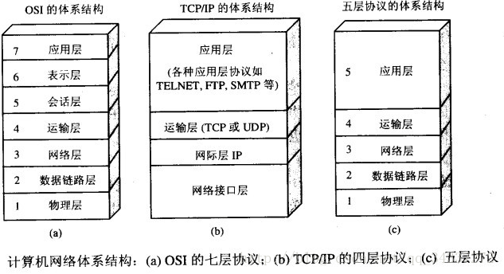

# 一、OSI 与 TCP/ IP 各层的结构与功能，都有哪些协议？

> **开放式系统互联通信参考模型**（英语：Open System Interconnection Reference Model，缩写为 OSI），简称为**OSI模型**（OSI model），一种[概念模型](https://baike.baidu.com/item/概念模型/3187025)，由[国际标准化组织](https://baike.baidu.com/item/国际标准化组织/779832)提出，一个试图使各种计算机在世界范围内互连为网络的标准框架。
>
> TCP/IP传输协议，即传输控制/网络协议，也叫作网络通讯协议。

## 1.1 应用层 - 进程之间

**应用层(application-layer）的任务是通过应用进程间的交互来完成特定网络应用**。应用层协议定义的是应用进程（进程：主机中正在运行的程序）间的通信和交互的规则。对于不同的网络应用需要不同的应用层协议。在互联网中应用层协议很多，如**域名系统 DNS**，支持万维网应用的 **HTTP 协议**，支持电子邮件的 **SMTP 协议**等等。我们把应用层交互的数据单元称为**报文**。

## 1.2 运输层 - 主机之间

**运输层(transport layer)的主要任务就是负责向两台主机进程之间的通信提供通用的数据传输服务**。应用进程利用该服务传送应用层报文。“通用的”是指并不针对某一个特定的网络应用，而是多种应用可以使用同一个运输层服务。由于一台主机可同时运行多个线程，因此运输层有复用和分用的功能。所谓复用就是指多个应用层进程可同时使用下面运输层的服务，分用和复用相反，是运输层把收到的信息分别交付上面应用层中的相应进程。

### 运输层使用协议

1. **传输控制协议 TCP**（Transmission Control Protocol）--提供**面向连接**的，**可靠的**数据传输服务。
2. **用户数据协议 UDP**（User Datagram Protocol）--提供**无连接**的，尽最大努力的数据传输服务（**不保证数据传输的可靠性**）。

## 1.3 网络层

**在计算机网络中进行通信的两个计算机之间可能会经过很多个数据链路，也可能还要经过很多通信子网。网络层的任务就是选择合适的网间路由和交换结点， 确保数据及时传送。** 在发送数据时，网络层把运输层产生的报文段或用户数据报封装成分组和包进行传送。在 TCP/IP 体系结构中，由于网络层使用 **IP 协议**，因此分组也叫 **IP 数据报** ，简称 **数据报**。

互联网是由大量的异构（heterogeneous）网络通过路由器（router）相互连接起来的。互联网使用的网络层协议是无连接的网际协议（Internet Protocol）和许多路由选择协议，因此互联网的网络层也叫做**网际层**或**IP 层**。

## 1.4 数据链路层

**数据链路层(data link layer)通常简称为链路层。两台主机之间的数据传输，总是在一段一段的链路上传送的，这就需要使用专门的链路层的协议。** 在两个相邻节点之间传送数据时，**数据链路层将网络层交下来的 IP 数据报组装成帧**，在两个相邻节点间的链路上传送帧。每一帧包括数据和必要的控制信息（如同步信息，地址信息，差错控制等）。

> 数据链路层不仅要查错，还要纠错。

## 1.5 物理层

**物理层(physical layer)的作用是实现相邻计算机节点之间比特流的透明传送，尽可能屏蔽掉具体传输介质和物理设备的差异，** 使其上面的数据链路层不必考虑网络的具体传输介质是什么。“透明传送比特流”表示经实际电路传送后的比特流没有发生变化，对传送的比特流来说，这个电路好像是看不见的。

## 总结（协议记不住）

