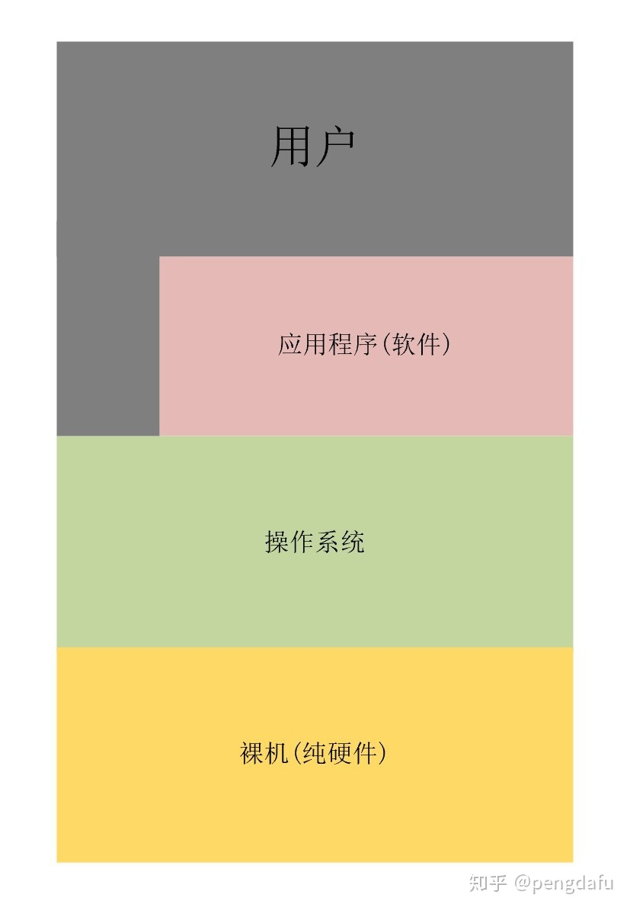
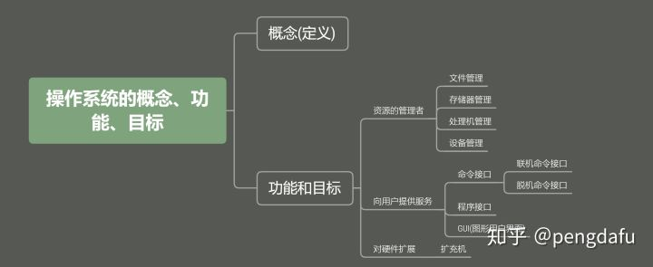

> [操作系统常见面试题总结 | JavaGuide](https://javaguide.cn/cs-basics/operating-system/操作系统常见面试题&知识点总结/)

# 一、操作系统基础

## 1.1 操作系统

[什么是操作系统？ - 知乎 (zhihu.com)](https://zhuanlan.zhihu.com/p/105945721)

操作系统(Operation System, OS) 是指控制和管理整个计算机系统的硬件和软件资源，并合理的组织和调度计算机的工作和资源的分配，以提供给用户和其它软件方便的接口和环境，它是计算机系统中最基本的系统软件。

**操作系统说明：**

1. 负责管理协调硬件、软件等计算机资源的工作
2. 为上层的应用程序、用户提供简单易用的服务
3. 操作系统是系统软件，而不是硬件

## 1.2 系统调用

根据进程访问资源的特点，我们可以把进程在系统上的运行分为两个级别：

1. 用户态(user mode)：用户态运行的进程可以直接读取用户程序的数据。
2. 内核态(kernel mode)：可以简单的理解系统态运行的进程或程序几乎可以访问计算机的任何资源，不受限制。

我们运行的程序基本都是运行在用户态，如果我们调用操作系统提供的系统态级别的子功能咋办呢？那就需要系统调用了！

也就是说在我们运行的用户程序中，凡是与系统态级别的资源有关的操作（如文件管理、进程控制、内存管理等)，都必须通过系统调用方式向操作系统提出服务请求，并由操作系统代为完成。

这些系统调用按功能大致可分为如下几类：

- 设备管理。完成设备的请求或释放，以及设备启动等功能。
- 文件管理。完成文件的读、写、创建及删除等功能。
- 进程控制。完成进程的创建、撤销、阻塞及唤醒等功能。
- 进程通信。完成进程之间的消息传递或信号传递等功能。
- 内存管理。完成内存的分配、回收以及获取作业占用内存区大小及地址等功能。

