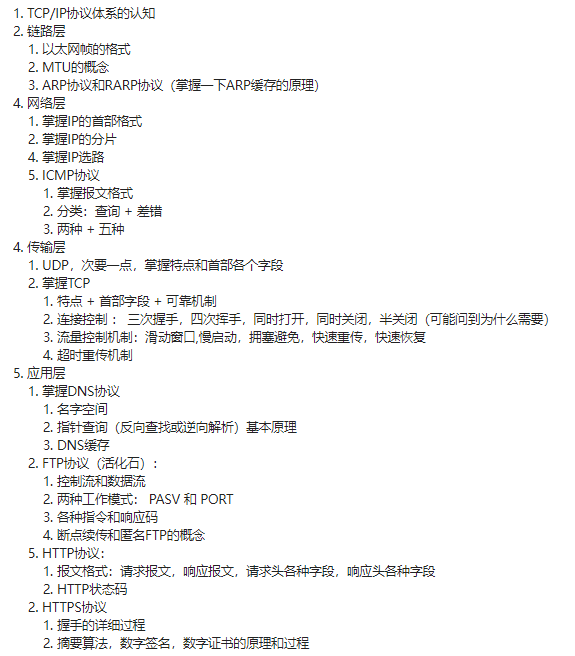

## 脉络整理

## 说明

网上的相关视频，似乎都太长了，可能他们真的足够详细，但是对我来说还是太长了。

我希望能通过一些基础的、简单易懂的内容，先去做一个整体了解。再逐块去深入理解不同的部分，因此网上下载了三本图解的书，希望能较快的速度做一个了解，下一步再看要如何深入学习。

## URL 和 URI

### 定义

- URL

> 统一资源**定位器**，它是WWW的统一资源定位标志，就是指网络地址。

- URI

> 统一资源**标识符**，统一资源标识符

### 联系 区别

- URL 是一种 URI
- URI就是一种资源定位机制。它是比較笼统地定位了资源，并不局限于client和server，
- 而URL就定位了网上的一切资源，仅仅要是网上的资源，都有唯一的URL.

