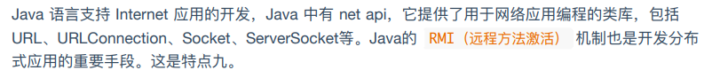
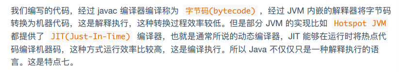
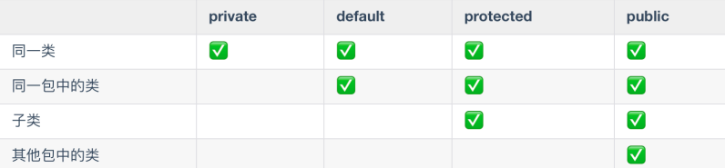
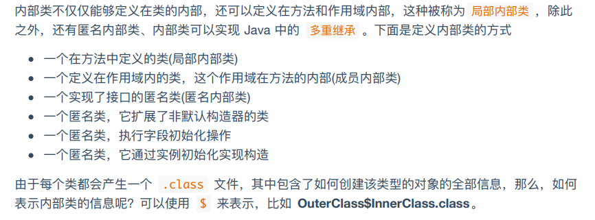
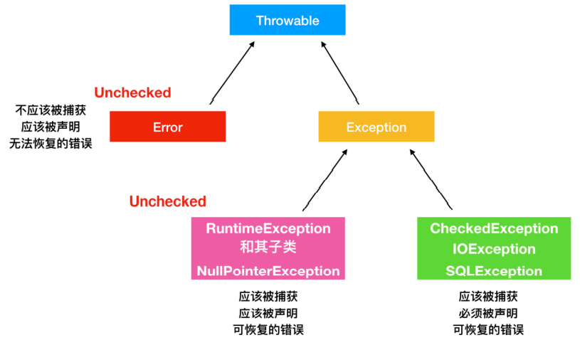
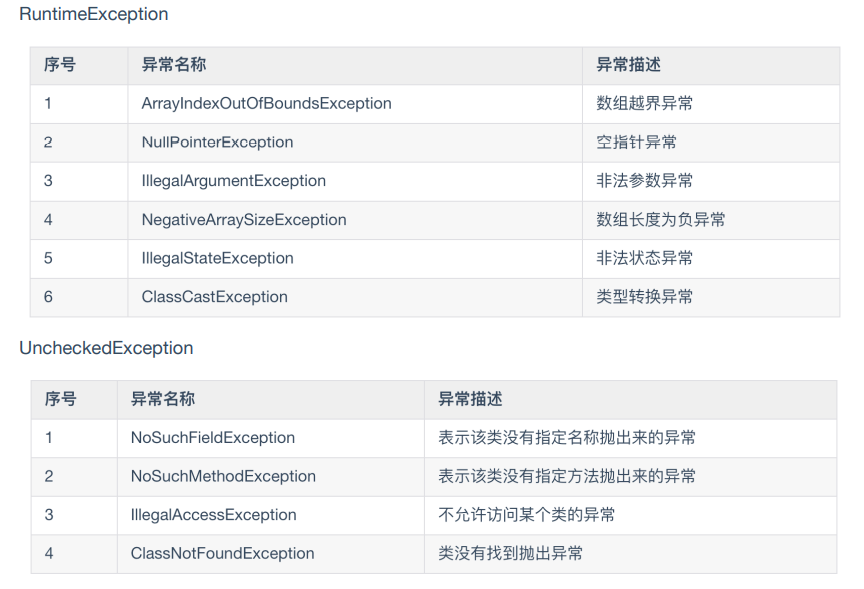
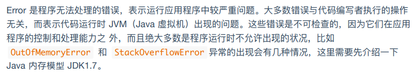
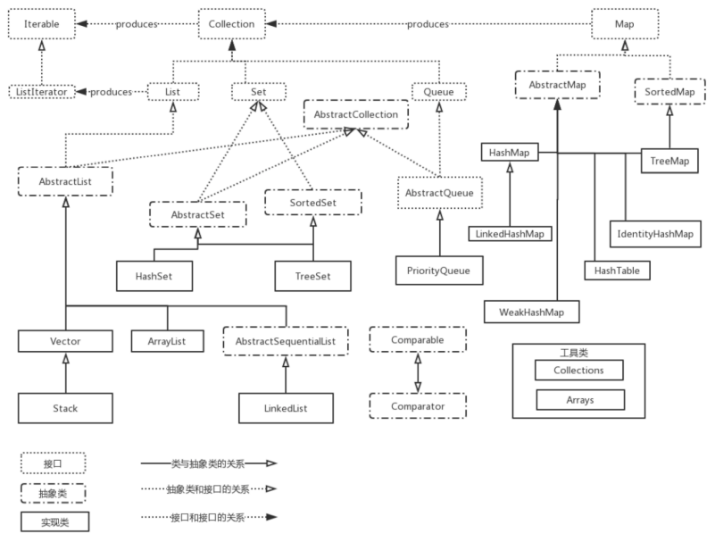

## java语言的特点

- 面向对象
- 平台无关性

> 已编译的java程序可以在任何带 有jvm的平台上运行。
>
> `java` 代码编译为 `.class` 文件，然后打包成 `.jar` 文件，这样就能够在不同系统下运行了。

- 简单性

> 摒弃了C++中难以理解的多继承、指针、内存管理等概念，不用手动管理对象的生命周期

- 解释执行

> 静态页面，在编译期间救恩那个直到数据类型的语言，在运行前就能检查类型的正确性。
>
> 执行效率相比动态语言更高，速度更快

- 多线程 

> java **应该** 在 `用户空间` 实现的多线程，内核感知不到 java 存在多线程机制。

- 分布式

> 

- 健壮性

> 强类型机制、异常处理、垃圾的自动收集

- 高性能

> 

- 安全性

## 面向对象


### 初始化顺序

> - 静态属性
> - 静态方法快
> - 普通方法
> - 普通方法块
> - 构造函数
> - 方法
```java
public class Solution {

    private static String staticField = getStaticField();

    public static String getStaticField() {
        String staticFiled = "静态属性初始化";
        System.out.println(staticFiled);
        return staticFiled;
    }

    static {
        System.out.println("静态方法块初始化");
    }

    private String field = getField();

    public String getField() {
        String field = "普通属性初始化";
        System.out.println(field);
        return field;
    }

    {
        System.out.println("普通方法块初始化");
    }

    public Solution() {
        System.out.println("构造函数");
    }

    public static void main(String[] args) {
        new Solution();
    }
}
```

```out
静态属性初始化
静态方法块初始化
普通属性初始化
普通方法块初始化
构造函数
```


---

### 三大特性

- 封装
- 继承
- 多态


#### 访问控制权限




---

### 接口

- interface、implements
- 接口只能使用 `public` `default`  两种访问修饰符
- 接口只提供方法的定义。
- 接口不能被实例化，所以接口中不能有构造方法。
- 接口的实现类必须实现接口的全部方法。


---

### 抽象类

- abstract
- 只有抽象类中能有抽象方法，抽象类中不只有抽象方法。
- 抽象类不能被实例化。


---

### 内部类

- 内部类拥有外部类的访问权限




## 异常


### Throwable

`Throable` 类是Java语言中所有 `错误(errors)` 和 `异常(exceptions)` 的父类。




### 常见异常




### Error




## 集合





### Iterable 接口


<table>
    <tr>
        <th colspan='5'></th>
        <th>实现原理</th>
        <th>线程安全</th>
        <th>允许null元素</th>
        <th>支持 `fail-fast` 机制</th> 
    </tr>
    <tr>
    	<td rowspan='20'>Iterable</td>
        <td rowspan='20'>Collection</td>
        <td rowspan='3'>List</td>
        <td>ArrayList</td>
        <td></td>
        <td>基于数组实现的可扩容数组</td>
        <td>不安全</td>
        <td>允许</td>
        <td>支持</td>
    </tr>
    <tr>
    	<td>Vector</td>
        <td>Stack</td>
        <td>基于数组实现</td>
        <td>安全</td>
        <td></td>
        <td></td>
    </tr>
    <tr>
    	<td>LinkedList</td>
        <td></td>
        <td>双向链表</td>
        <td>不安全</td>
        <td>允许</td>
        <td></td>
    </tr>
    <tr>
    	<td rowspan='3'>Set</td>
        <td rowspan='2'>HashSet</td>
        <td></td>
        <td>HashMap 的实例</td>
        <td>不安全</td>
        <td>允许</td>
        <td>支持</td>
    </tr>
    <tr>
    	<td>LinkedHashSet</td>
        <td>双线链表</td>
        <td>不安全</td>
        <td></td>
        <td>支持</td>
    </tr>
    <tr>
    	<td>TreeSet</td>
        <td></td>
        <td>基于 TreeMap 的 Navigation 实现</td>
        <td>不安全</td>
        <td></td>
        <td>支持</td>
    </tr>
    <tr>
    	<td>Queue</td>
        <td>PriorityQueue</td>
        <td></td>
        <td></td>
        <td>不安全</td>
        <td>不允许</td>
        <td>支持</td>
    </tr>
    <tr>
    	<td>Map</td>
    </tr>
</table>


- Collection
    - List
        - ArrayList
            - 可扩容数组，基于数组实现
            - 不是线程安全的，应使用 `Collections.synchronizedList`
            - `fail-fast` 快速失败机制 - ？
            - 扩容增加 50%
        - Vector
            - 基于数组实现
            - **线程安全**，代价是开销更大，访问效率远低于 ArrayList
            - 扩容增加 一倍
            - Stack 继承了 Vector
        - LinkedList
            - 双向链表
            - 不是线程安全的
    - Set
        - HashSet
            - 实际上是 `HashMap` 的一个实例
            - 不能保证集合的迭代顺序
            - 不是线程安全的，应使用 `Colletions.synchronizedSet`
            - 支持 `fail-fast` 机制
        - TreeSet
            - 基于 `TreeMap` 的 NavigableSet 实现
            - 提供自然排序和自定排序
            - 不是线程安全的
            - 支持 `fail-fast` 机制
        - LinkedHashSet
            - 维护双向链表
            - 不是线程安全的
            - 支持 `fail-fast` 机制
    - Queue
        - PriorityQueue
            - 
    - Map


## 插眼：

#### JDK、JRE、JVM

#### switch 实现原理

#### 深浅拷贝

#### 代理，意义何在

#### 面向对象三大特性

#### 修饰符
