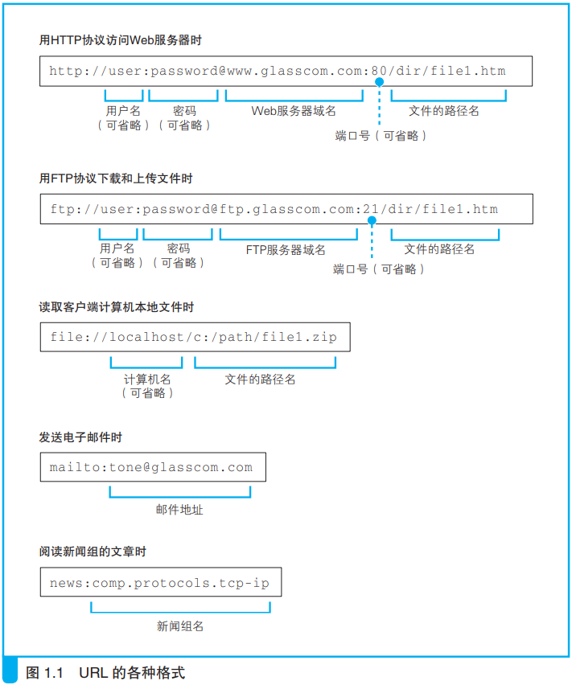
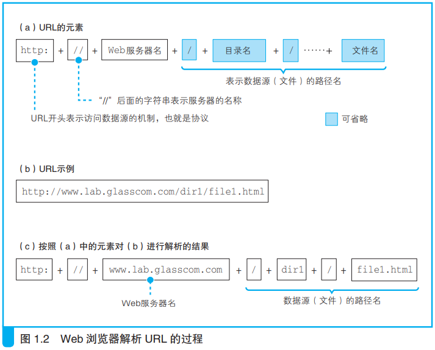
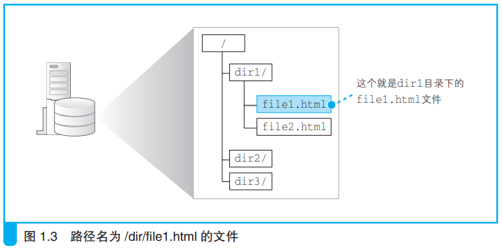
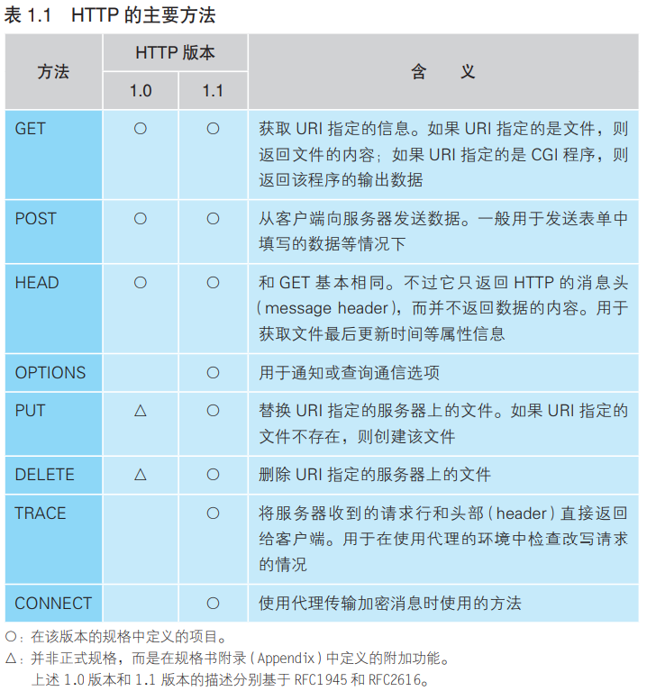
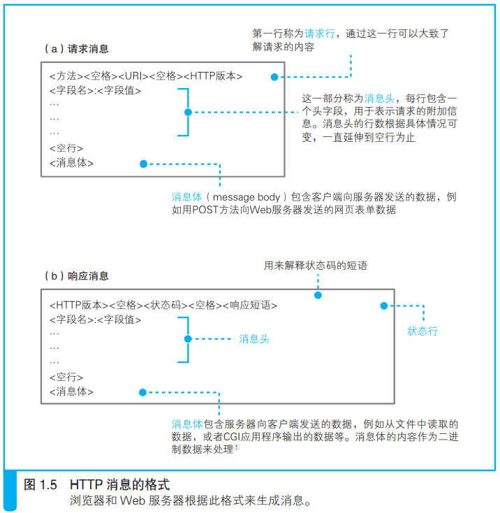
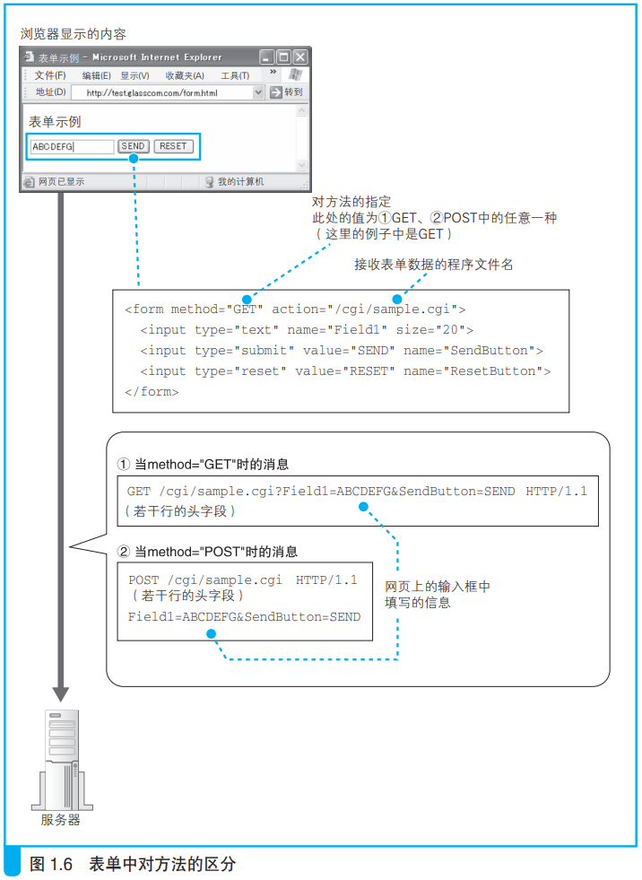
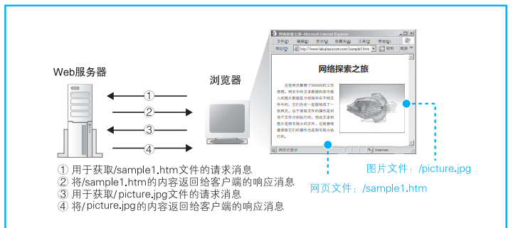

# 第一章 浏览器生成消息

## 生成 HTTP 请求消息

### 网址（URL, Uniform Resource Locator）

### 解析 URL

### 文件名省略

- 当 URL 以 `/` 结尾时，服务器会默认访问该路径下的 `index.html` 或 `default.html` 文件
- 当 URL 连 `/` 和文件类型都省略的时候：

（实测：当一个文件没有文件类型的时候，不允许和一个同名文件夹同时存在。而当这个文件有后缀时，应该会访问同名文件夹）

### HTTP 基本思路

- 对什么 + 进行怎样的操作

### 生成 HTTP 请求信息

- 一条请求消息中只能写一个URI。如果需要获取多个文件，必须对每个文件单独发送一条请求

更多字段信息见文档 44 页。

### 服务器响应

- 状态码时一个数字，主要用来向程序告知执行的结果
- 响应短语是一段文字，用来向人们告知执行的结果

